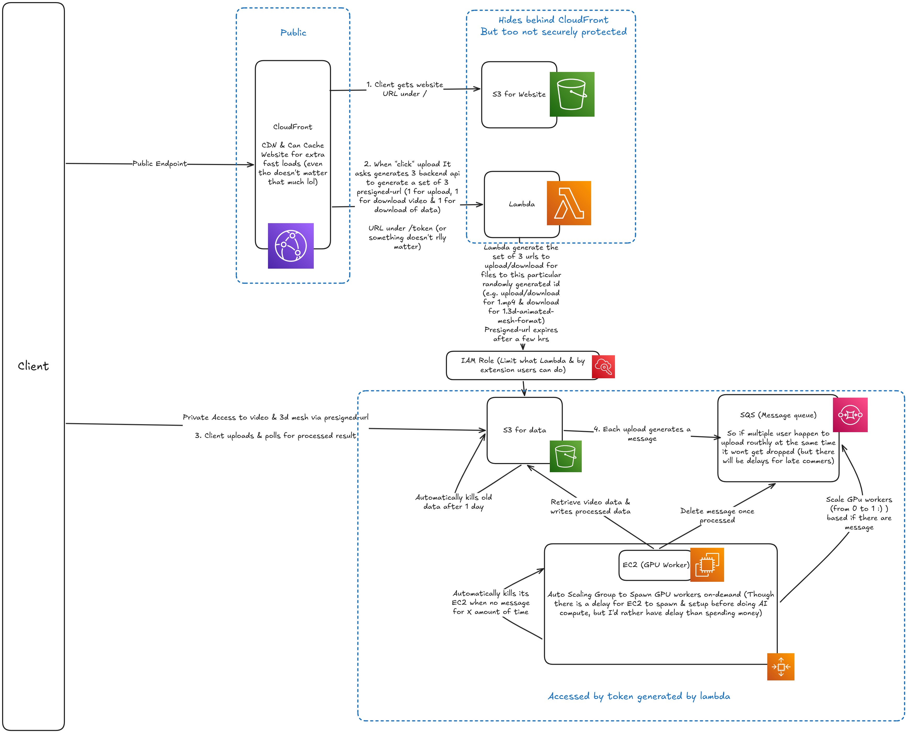

# About

I love skiing and my dream is to carve bigg clean turns, hip on the snow, down a wide-open slope enjoying the beautiful view. But, everytime I try to compare my skiing with a good skier I have to go through a lot. I have to go back and forth between videos, look for the exact frame, and repeat this so many times until I finally get a glimpse of what's looking good and what's not. Also, it is often the case that the camera angle and distance isn't exactly the same (mine might be taken from down the slope but the other might be taken from across the slope), making an analysis so much more tiring than it should be.

This motivated the development of Random-skier (poor naming sense by alex), which is a web platform that creates a 3D model of your skiing and lets you compare it with top skiers in a interactive 3D environment.

# Our Approach

## Frontend

We render the 3D model client-side in the browser to allow real-time interaction. We used Three.js because it has a nice documentation and a big community (too often I've been stuck trying to use things that aren't popular) and we wanted to practice using high-level APIs. We also used some other libraries like GSAP to make things look nicer.

## Backend

Our reconstruction pipeline is built on SAM-Body4D, which is a training-free framework for temporally consistent 4D human mesh reconstruction from videos, proposed in a recent paper by Gao et al (2025). Under the hood, it's a composite pipeline that uses SAM 3 for masking, diffusion-VAS for handling occlusions, and SAM 3D Body for HMR at each frame.

This is quite a heavy computation, so it's done server-side on cloud GPUs (computers around us couldn't handle it). Master alex did some magic. Hopefully he teaches me :)

## Architecture stuff

This is the big picture

